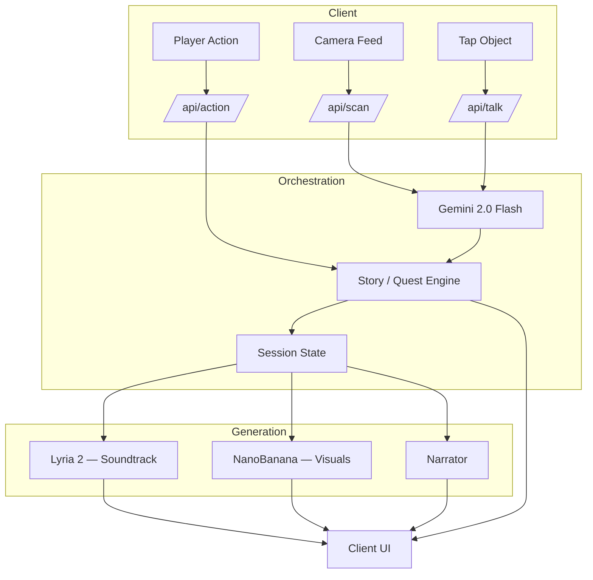

# Main Character Mode

Turn your world into a game. Point your phone camera at any room and watch everyday objects become characters with personalities, relationships, and quests — scored by adaptive music and wrapped in generated visuals.

Built for the YC x Google DeepMind Hackathon.

## Features

- **Real-time scene understanding** — Gemini 2.0 Flash analyzes camera frames to detect objects, classify scenes, and identify interaction points
- **Object personification** — detected objects become characters with names, personalities, emotional states, and relationship stances (lamp → jealous poet, chair → loyal bodyguard)
- **Voice and text interaction** — tap any object-character to talk via modes like flirt, interrogate, recruit, roast, or apologize
- **Relationship and memory system** — characters remember conversations, form alliances and rivalries, and reference how you treated them
- **Quest generation** — characters issue contextual quests based on the environment and narrative state
- **Adaptive soundtrack** — Lyria 2 generates music that shifts with scene mood, narrative tension, and player actions
- **Visual synthesis** — NanoBanana generates character cards, expression variants, and session recap posters
- **Dynamic narration** — an AI narrator frames events in real time ("You turned away from the lamp. It took that personally.")
- **Two play modes** — Story Mode (object characters, dialogue, relationships) and Quest Mode (real tasks become cinematic missions with momentum and XP)
- **Session recap** — episode title, poster, relationship summaries, and dramatic highlights at end of session
- **Demo mode** — runs with hardcoded mock data, no API keys required

## Tech Stack

| Layer | Technology |
|-------|------------|
| Framework | Next.js 16 (App Router, Turbopack) |
| UI | React 18, Tailwind CSS 3, Framer Motion |
| AI — perception & reasoning | Gemini 2.0 Flash (`@google/genai`) |
| AI — music | Lyria 2 (Vertex AI) |
| AI — visuals | NanoBanana / Imagen 3 |
| Vision | MediaPipe Tasks Vision (gesture detection) |
| Export | html-to-image, jsPDF, Jimp |
| Language | TypeScript 5 |

## Project Structure

```
├── public/
│   └── manifest.json            # PWA manifest
├── src/
│   ├── app/
│   │   ├── page.tsx             # Landing — mode selector, genre picker
│   │   ├── story/page.tsx       # Story Mode — camera, characters, quests
│   │   ├── quest/page.tsx       # Quest Mode — tasks, missions, momentum
│   │   ├── recap/page.tsx       # Session recap poster
│   │   ├── api/
│   │   │   ├── session/         # POST — create story or quest session
│   │   │   ├── scan/            # POST — camera frame → scene analysis
│   │   │   ├── talk/            # POST — dialogue with object-character
│   │   │   ├── action/          # POST — quest accept, choice, item use
│   │   │   ├── task/            # POST/GET — add task, list missions
│   │   │   ├── progress/        # POST — report quest progress
│   │   │   ├── music/           # GET — current Lyria track state
│   │   │   ├── poster/          # POST — generate recap poster
│   │   │   ├── expressions/     # POST — character expression variants
│   │   │   ├── recall/          # POST — dialogue with saved characters
│   │   │   └── suggest/         # POST — suggest player message
│   │   ├── globals.css
│   │   └── layout.tsx
│   ├── components/
│   │   ├── shared/              # Camera, NarrationBanner, XPBar, MusicIndicator, etc.
│   │   ├── story/               # StoryHUD, InteractionModal, QuestCard, CharacterPortrait, etc.
│   │   ├── quest/               # QuestHUD, MissionBriefing, MomentumMeter, TaskInput, etc.
│   │   └── landing/             # TabBar, HowToPlay, CharacterCollection, PressStart, etc.
│   ├── hooks/
│   │   ├── useVoiceAgent.ts     # Voice interaction with characters
│   │   ├── useFrontCamera.ts    # Front camera access
│   │   └── useGestureDetection.ts # MediaPipe gesture detection
│   ├── lib/
│   │   ├── shared/
│   │   │   ├── gemini.ts        # Gemini API wrapper
│   │   │   ├── lyria.ts         # Lyria API wrapper (static fallback)
│   │   │   ├── nanobanana.ts    # NanoBanana / Imagen 3 wrapper
│   │   │   ├── narrator.ts      # Dynamic narration generation
│   │   │   ├── progression.ts   # XP, levels, streaks
│   │   │   ├── sessions.ts      # In-memory session store
│   │   │   ├── prompts.ts       # Central prompt templates
│   │   │   └── characterCollection.ts
│   │   ├── story/
│   │   │   ├── personification.ts  # Object → character via Gemini
│   │   │   ├── relationships.ts    # Relationship graph and memory
│   │   │   ├── storyEngine.ts      # Story state machine, quest gen
│   │   │   └── escalation.ts       # Escalation triggers
│   │   └── quest/
│   │       ├── taskManager.ts      # Task CRUD
│   │       ├── missionFramer.ts    # Task → cinematic mission
│   │       ├── contextDetector.ts  # Scene → context tags
│   │       └── momentumTracker.ts  # Streaks, combos, momentum
│   └── types/
│       └── index.ts             # Shared TypeScript types
├── plans/
│   ├── DESCRIPTION.md           # Product thesis and architecture
│   ├── PLAN.md                  # Implementation plan and data models
│   └── FEATURE_LIST.md          # Feature list and MVP scope
├── package.json
├── tsconfig.json
├── tailwind.config.ts
├── postcss.config.js
└── next.config.ts
```

## Quickstart

```bash
# Install dependencies
npm install

# Copy env template and fill in your keys (or leave demo mode on)
cp .env.local.example .env.local

# Start dev server
npm run dev
```

Open [http://localhost:3000](http://localhost:3000).

## Environment Variables

Copy `.env.local.example` to `.env.local`. All keys are optional — missing keys trigger graceful fallbacks.

| Variable | Required | Description |
|----------|----------|-------------|
| `NEXT_PUBLIC_DEMO_MODE` | No | `true` (default) for mock data, `false` for live API calls |
| `GEMINI_API_KEY` | For live mode | Gemini 2.0 Flash API key |
| `LYRIA_PROJECT_ID` | For music | GCP project ID for Vertex AI |
| `LYRIA_LOCATION` | For music | Vertex AI region (default: `us-central1`) |
| `LYRIA_ACCESS_TOKEN` | For music | Short-lived Bearer token (`gcloud auth print-access-token`) |
| `NANOBANANA_API_KEY` | For visuals | NanoBanana API key (falls back to Gemini key for Imagen 3) |

## Scripts

```bash
npm run dev      # Start dev server (Turbopack)
npm run build    # Production build
npm run start    # Start production server
npm run lint     # Run ESLint
```

## Architecture



1. The client captures camera frames and user interactions
2. Gemini interprets frames into a structured scene graph (objects, spatial context, mood, affordances)
3. The story/quest engine uses the scene graph to advance narrative state — spawn NPCs, issue quests, branch the story
4. Lyria, NanoBanana, and the narrator generate media conditioned on the same session state
5. The client renders characters, dialogue, quests, music, and visuals as a coherent experience

## .gitignore

The repository ignores:

- `node_modules/` — npm dependencies
- `.next/`, `out/` — Next.js build artifacts
- `.env`, `.env.local`, `.env.*.local` — environment variables and secrets
- `.DS_Store`, `Thumbs.db` — OS metadata
- `.vscode/`, `*.swp`, `*.swo` — editor files
- `npm-debug.log*`, `yarn-debug.log*`, `yarn-error.log*` — debug logs
- `*.tsbuildinfo` — TypeScript incremental build cache
- `.vercel` — Vercel deployment metadata

## License

Hackathon project — not currently licensed for redistribution.
