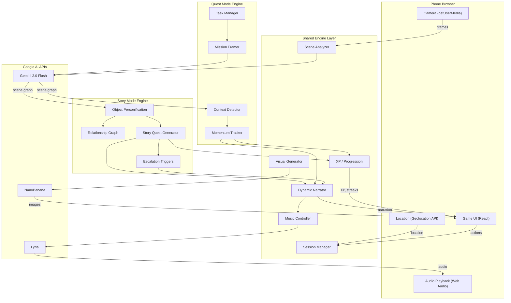

# Implementation Plan: Main Character Mode

## Product Thesis

**Main Character Mode** turns both your environment and your daily routines into an interactive game layer.

- **Story Mode** answers: "What if my world became a game?"
- **Quest Mode** answers: "What if my life had momentum, feedback, and progression?"

One engine, two intents. The playful worldbuilding is the hook. The real-life motivation layer is the deeper value.

Startup framing: *We're building an AI-generated motivation layer for daily life. The playful worldbuilding is the hook, but the deeper value is turning passive routines into active, adaptive quests.*

---

## Two Modes, One Engine

### Story Mode -- "I want to play"

Your furniture becomes characters. Your room becomes a game. Weird things happen.

- Object detection and personification (lamp = jealous poet, toaster = unstable ex)
- Tap-to-talk with interaction modes (flirt, interrogate, roast, apologize)
- Relationship and memory system (objects remember, get jealous, form alliances)
- Quests issued by objects, escalation events, narrative arcs
- Genre sub-modes: dating sim, mystery, fantasy, survival, workplace drama, soap opera

### Quest Mode -- "I want help functioning"

Your errands, chores, and routines become missions that help you actually get things done.

- Real-world tasks converted into cinematic missions (groceries = supply run, laundry = cleansing ritual, inbox = threat containment)
- Context-aware mission activation (kitchen detected = cooking quest, desk + laptop = focus session)
- Progress tracking from camera context signals
- XP, streaks, combo bonuses, progression trees
- End-of-day recap as "completed campaign"

### Shared Engine (Both Modes)

- Multimodal scene understanding (Gemini)
- State tracking and session management
- Dynamic narration layer
- Adaptive soundtrack (Lyria)
- Reward and progression system
- Visual asset generation (NanoBanana)
- Recap / poster output

### How the Modes Connect

They reinforce each other:

- Completing real-life quests unlocks new characters or scenes in Story Mode
- Room characters comment on your productivity ("The desk noticed you've been avoiding it")
- Neglected chores make certain characters annoyed or hostile
- Grocery completion unlocks a kitchen storyline
- Consistent routines improve your "world state"

---

## MVP Scope

### Must-Have (Demo)

**Story Mode**:

- Live camera object detection
- Object personification (name, personality, emotional state, relationship stance)
- Voice or text interaction (tap to talk, interaction modes)
- Relationship and memory state
- Simple quest generation from objects
- Adaptive soundtrack
- End-of-session recap poster

**Quest Mode**:

- Manual task input (type or voice a task)
- AI mission framing (task -> cinematic mission with narrative)
- Camera context detection (recognizes relevant environment)
- Progress narration and momentum soundtrack
- XP and streak tracking
- End-of-day campaign recap

### Nice-to-Have

- One mini-game mode in Story (e.g., appliance revolt boss battle)
- One escalation event in Story (e.g., heartbreak arc)
- Calendar/to-do app import for Quest Mode
- Cross-mode connections (Quest completions affecting Story characters)

### Deprioritized

- Full environmental distortion
- Multiplayer / shared environment
- Deep AR anchoring
- Complex action gameplay
- Persistent world state across days

---

## Architecture

Single Next.js 14 (App Router) project. Phone browser as client; Next.js API routes as backend.




---

## Project Structure

```
/
├── package.json
├── next.config.ts
├── tailwind.config.ts
├── .env.local
├── src/
│   ├── app/
│   │   ├── layout.tsx
│   │   ├── page.tsx                     # Landing: Story Mode / Quest Mode selector
│   │   ├── story/page.tsx               # Story Mode game screen
│   │   ├── quest/page.tsx               # Quest Mode mission screen
│   │   ├── recap/page.tsx               # Episode / campaign recap
│   │   └── api/
│   │       ├── session/route.ts         # POST: create session (story or quest)
│   │       ├── scan/route.ts            # POST: camera frame -> scene analysis
│   │       ├── talk/route.ts            # POST: talk to object (Story Mode)
│   │       ├── action/route.ts          # POST: quest accept, choice, item use
│   │       ├── task/route.ts            # POST: add task; GET: list missions (Quest Mode)
│   │       ├── progress/route.ts        # POST: report progress signal (Quest Mode)
│   │       ├── music/route.ts           # GET: current music
│   │       └── poster/route.ts          # POST: generate recap poster/campaign summary
│   ├── components/
│   │   ├── shared/
│   │   │   ├── Camera.tsx               # getUserMedia + frame capture
│   │   │   ├── NarrationBanner.tsx      # Dynamic narrator overlay
│   │   │   ├── ModeSelector.tsx         # Story / Quest mode picker
│   │   │   ├── XPBar.tsx               # XP and level display
│   │   │   └── RecapPoster.tsx          # End-of-session poster
│   │   ├── story/
│   │   │   ├── StoryHUD.tsx             # Story Mode heads-up display
│   │   │   ├── ObjectLabel.tsx          # Floating character name tag
│   │   │   ├── InteractionModal.tsx     # Tap-to-talk: mode picker + dialogue
│   │   │   ├── QuestCard.tsx            # Quest cards from objects
│   │   │   ├── RelationshipBar.tsx      # Relationship score indicator
│   │   │   └── MiniGame.tsx             # Optional mini-game overlay
│   │   └── quest/
│   │       ├── QuestHUD.tsx             # Quest Mode heads-up display
│   │       ├── MissionBriefing.tsx      # Cinematic mission card
│   │       ├── TaskInput.tsx            # Add task (text/voice)
│   │       ├── ActiveMission.tsx        # Current mission with progress
│   │       ├── MomentumMeter.tsx        # Momentum / streak visual
│   │       └── CampaignRecap.tsx        # End-of-day campaign summary
│   ├── lib/
│   │   ├── shared/
│   │   │   ├── gemini.ts               # Gemini API wrapper
│   │   │   ├── lyria.ts                # Lyria API wrapper
│   │   │   ├── nanobanana.ts           # NanoBanana API wrapper
│   │   │   ├── narrator.ts             # Dynamic narration (both modes)
│   │   │   ├── progression.ts          # XP, levels, streaks, combos
│   │   │   ├── sessions.ts             # Session store (Map<id, SessionState>)
│   │   │   └── prompts.ts              # All AI prompt templates
│   │   ├── story/
│   │   │   ├── personification.ts      # Object -> Character engine
│   │   │   ├── relationships.ts        # Relationship graph + memory
│   │   │   ├── storyEngine.ts          # Story state machine + quest gen
│   │   │   └── escalation.ts           # Threshold-based dramatic events
│   │   └── quest/
│   │       ├── taskManager.ts          # Task CRUD + mission queue
│   │       ├── missionFramer.ts        # Task -> cinematic mission (Gemini)
│   │       ├── contextDetector.ts      # Scene -> task relevance matching
│   │       └── momentumTracker.ts      # Streaks, combos, momentum state
│   └── types/
│       └── index.ts                     # All shared TypeScript types
```

---

## Core Data Model

```typescript
// Top-level session -- mode determines which sub-state is active
interface SessionState {
  id: string;
  activeMode: "story" | "quest";
  sceneGraph: SceneGraph;
  narrativeLog: NarrationEvent[];
  musicState: MusicState;
  progression: ProgressionState;
  storyState?: StoryModeState;
  questState?: QuestModeState;
  startedAt: number;
  location?: { lat: number; lng: number };
}

// Shared across modes
interface ProgressionState {
  xp: number;
  level: number;
  currentStreak: number;
  longestStreak: number;
  completedToday: number;
  badges: string[];
}

interface SceneGraph {
  sceneType: string;                   // "bedroom", "office", "kitchen", "grocery store"
  objects: DetectedObject[];
  mood: string;
  spatialContext: string;
}

interface DetectedObject {
  id: string;
  label: string;
  salience: number;
  position: "left" | "center" | "right" | "background";
  context: string;
}

interface NarrationEvent {
  text: string;
  tone: "dramatic" | "documentary" | "deadpan" | "chaotic" | "cinematic_briefing";
  timestamp: number;
}
```

### Story Mode Types

```typescript
interface StoryModeState {
  genre: "dating_sim" | "mystery" | "fantasy" | "survival" | "workplace_drama" | "soap_opera";
  phase: "scanning" | "exploring" | "quest_active" | "escalation" | "climax" | "recap";
  characters: ObjectCharacter[];
  relationships: RelationshipEdge[];
  activeQuests: StoryQuest[];
  conversationLog: ConversationEntry[];
}

interface ObjectCharacter {
  id: string;
  objectLabel: string;                 // "lamp"
  name: string;                        // "Lucian"
  personality: string;                 // "jealous poet"
  voiceStyle: string;                  // "dramatic whisper"
  emotionalState: string;              // "longing"
  relationshipToUser: number;          // -100 to 100
  relationshipStance: string;          // "secretly in love"
  memories: string[];
  portraitUrl?: string;
}

interface RelationshipEdge {
  fromId: string;
  toId: string;
  type: "alliance" | "rivalry" | "crush" | "grudge" | "indifferent";
  intensity: number;
  reason: string;
}

interface StoryQuest {
  id: string;
  issuedBy: string;
  title: string;
  description: string;
  type: "fetch" | "social" | "choice" | "challenge" | "survival";
  status: "available" | "active" | "completed" | "failed";
}

interface ConversationEntry {
  characterId: string;
  mode: InteractionMode;
  userMessage: string;
  characterResponse: string;
  relationshipDelta: number;
  timestamp: number;
}

type InteractionMode = "flirt" | "interrogate" | "recruit" | "befriend" | "roast" | "apologize";
```

### Quest Mode Types

```typescript
interface QuestModeState {
  missions: Mission[];
  activeMissionId: string | null;
  completedCampaigns: CampaignRecap[];
  momentum: MomentumState;
}

interface Mission {
  id: string;
  originalTask: string;              // "do laundry"
  codename: string;                  // "Operation: Cleansing Ritual"
  briefing: string;                  // cinematic mission description
  category: "supply_run" | "restoration" | "containment" | "crafting" | "knowledge_raid" | "recon" | "endurance";
  status: "briefed" | "active" | "completed" | "abandoned";
  xpReward: number;
  contextTrigger?: string;           // scene type that auto-activates this mission
  objectives: MissionObjective[];
  startedAt?: number;
  completedAt?: number;
}

interface MissionObjective {
  id: string;
  description: string;               // "Acquire all items on the manifest"
  completed: boolean;
}

interface MomentumState {
  currentCombo: number;              // consecutive completed objectives
  sessionProductivityScore: number;  // 0-100
  lastActivityAt: number;
  idlePenaltyTriggered: boolean;
}

// Task -> Mission framing examples:
// "groceries"      -> { codename: "Supply Run: Sector 7", category: "supply_run" }
// "laundry"        -> { codename: "Operation: Cleansing Ritual", category: "restoration" }
// "clear inbox"    -> { codename: "Threat Containment: Inbox Zero", category: "containment" }
// "meal prep"      -> { codename: "Crafting Sequence: Evening Rations", category: "crafting" }
// "study for exam" -> { codename: "Knowledge Raid: Chapter 12", category: "knowledge_raid" }
// "clean room"     -> { codename: "Dungeon Restoration: Base Camp", category: "restoration" }

interface CampaignRecap {
  date: string;
  missionsCompleted: number;
  totalXP: number;
  longestCombo: number;
  highlightMission: string;
  posterUrl?: string;
}
```

---

## Key Implementation Details

### Shared: Camera Capture (`Camera.tsx`)

- `navigator.mediaDevices.getUserMedia({ video: { facingMode: "environment" } })` for rear camera
- Frame capture every ~3-5 seconds via hidden `<canvas>`, base64 JPEG (quality 0.6, max 720p)
- POST to `/api/scan` with session ID
- Live camera feed as full-screen background via `<video>` element
- Used by both modes: Story Mode for object detection, Quest Mode for context detection

### Shared: Scene Understanding (`/api/scan` + `gemini.ts`)

- Gemini 2.0 Flash with structured JSON output
- Prompt adapts based on active mode:
  - **Story Mode**: "identify objects, their salience, positions, and mood of the scene"
  - **Quest Mode**: "identify the environment type, what activity is happening, and what tasks this context is relevant to"
- `response_mime_type: "application/json"` for reliable structured output

### Shared: Dynamic Narration (`narrator.ts`)

- AI narrator frames events in real time via `NarrationBanner.tsx`
- **Story Mode tone**: dramatic, documentary, deadpan, chaotic
  - "You turned away from the lamp. It took that personally."
- **Quest Mode tone**: cinematic briefing, field dispatch, mission control
  - "Supply run complete. Morale stabilized. Kitchen campaign unlocked."
  - "Focus session interrupted. Distraction detected. Recalibrating."
- Critical design choice: Quest Mode narration must *not* feel like childish gamification. Target cinematic behavioral feedback, not "Yay! 10 coins for buying milk!"

### Shared: Adaptive Soundtrack (`lyria.ts` + `/api/music`)

- Control signals: `{ mood, tempo, intensity, environment, activeMode }`
- **Story Mode**: romantic, suspenseful, chaotic, tragic, comedic
  - Soft lo-fi during banter, swelling strings during confession, boss music during appliance revolt
- **Quest Mode**: focused, driving, triumphant, urgent
  - Lo-fi focus beats during study, driving tempo during errands, triumphant swell on mission complete
- Cache per mood/phase; crossfade via Web Audio API
- Fallback: pre-generated mood tracks

### Shared: Progression System (`progression.ts`)

- XP earned in both modes (shared pool)
- Streaks: consecutive days with at least one completed mission/quest
- Combo bonuses: consecutive completed objectives without idle gaps
- Levels unlock: new narrator voices, genre presets, character archetypes
- Badges for milestones

### Shared: Visual Assets (`nanobanana.ts`)

- **Story Mode**: character portraits, quest item icons
- **Quest Mode**: mission briefing cards, campaign poster
- **Both**: end-of-session recap poster

---

### Story Mode: Object Personification (`personification.ts`)

For each detected object, Gemini generates a full character:

- **Input**: object label + scene context + genre mode
- **Output**: name, personality archetype, voice style, emotional state, relationship stance
- Grounded in real-world function: chair = "clingy coworker energy", water bottle = "low-maintenance but emotionally neglected", bed = "seductive but destructive influence"
- Inter-object relationships auto-generated (alliances, rivalries, crushes, grudges)
- Characters persist across scans within a session; new objects personified on first detection

### Story Mode: Voice/Text Interaction (`/api/talk` + `InteractionModal.tsx`)

- Tap detected object to initiate conversation
- **Interaction mode picker**: flirt, interrogate, recruit, befriend, roast, apologize
- Gemini generates in-character response conditioned on: personality, emotional state, voice style, conversation history, relationship score, chosen interaction mode, nearby characters
- Response updates relationship score, may trigger narration, quest, or escalation

### Story Mode: Relationship and Memory (`relationships.ts`)

- `relationshipToUser` (-100 to 100) per character, updated on every interaction
- Objects aware of how user treats other objects ("the sofa knows you complimented the chair")
- `RelationshipEdge[]` for inter-object dynamics
- Memory summaries compressed and fed into future prompts
- Threshold crossings (> 80 or < -50) trigger escalation events

### Story Mode: Quests and Escalation (`storyEngine.ts` + `escalation.ts`)

- Objects issue quests: "Ask the kettle what it knows", "Choose between me and the couch"
- Quest types: fetch, social, choice, challenge, survival
- Escalation triggers when tension/jealousy/conflict crosses thresholds:
  - Rejection -> heartbreak arc
  - Object jealousy -> argument scene
  - Unresolved conflict -> boss sequence

### Story Mode: Mini-Games (`MiniGame.tsx`) -- Nice-to-Have

- Triggered by escalation events or specific scene states
- Objects become gameplay entities: mug = throwable, chair = cover, lamp = turret, vacuum = boss
- Simple tap/swipe mechanics overlaid on camera feed

---

### Quest Mode: Task Manager (`taskManager.ts` + `/api/task`)

- User adds tasks via text input or voice (Web Speech API)
- Tasks stored as simple strings; Gemini does the creative framing
- Task queue with priority ordering
- Future: import from calendar or to-do app APIs

### Quest Mode: Mission Framing (`missionFramer.ts`)

- Core creative step: Gemini converts a mundane task into a cinematic mission
- **Input**: task string + scene context + time of day + user history
- **Output**: codename, briefing text, category, objectives, XP reward
- Tone is cinematic and dry, not cute: "Supply run complete. Morale stabilized." not "Yay! You bought milk!"
- Categories map to task types: supply_run, restoration, containment, crafting, knowledge_raid, recon, endurance

### Quest Mode: Context Detection (`contextDetector.ts`)

- Uses scene graph from `/api/scan` to match environment to pending missions
- Grocery store detected -> supply_run missions auto-activate
- Kitchen detected -> crafting missions suggested
- Desk + laptop + low movement -> focus session starts
- Long inactivity -> quest reminder or "enemy event" narration
- Context signals: scene type, detected objects, location, time, user movement patterns

### Quest Mode: Momentum Tracking (`momentumTracker.ts`)

- Tracks combo count (consecutive completed objectives)
- Session productivity score (0-100, affects music intensity and narration tone)
- Idle detection: triggers narrator prompts ("Command has noticed the silence. Status report requested.")
- Momentum affects soundtrack: high momentum = driving tempo, low momentum = ambient + narrator nudge

### Quest Mode: Rewards and Recap

- XP on mission completion, bonus for combos and streaks
- End-of-day campaign recap: missions completed, total XP, longest combo, highlight mission, generated poster
- Poster prompt: "A cinematic campaign summary poster showing [tasks completed] with [tone of the day]"

---

## Game UI

### Story Mode UI

- **Full-screen camera feed** as background
- **ObjectLabel**: floating name tags on detected objects (name + emoji + relationship indicator)
- **InteractionModal**: slides up on tap; mode picker, dialogue, relationship bar
- **QuestCard**: slides in from bottom when object issues a quest
- **NarrationBanner**: cinematic text overlay at top of screen
- **RelationshipBar**: visual score during interactions
- **StoryHUD**: current quest, character count, session timer
- Style: dark glassmorphism with genre-tinted accents (warm for dating sim, cold blue for mystery, neon for survival)

### Quest Mode UI

- **Camera feed** as ambient background (or minimal view)
- **MissionBriefing**: cinematic mission card with codename, briefing, objectives
- **ActiveMission**: current mission with objective checklist and progress
- **TaskInput**: text field + optional voice button to add tasks
- **MomentumMeter**: visual combo/streak indicator, pulsing with momentum
- **NarrationBanner**: mission control style narration ("Threat contained. Advancing to next objective.")
- **QuestHUD**: active mission, XP total, streak count, day progress
- **CampaignRecap**: end-of-day summary with stats and poster
- Style: darker, more utilitarian glassmorphism; cinematic mission-control aesthetic

---

## API Endpoints

- `POST /api/session` -- `{ mode: "story" | "quest", genre? }` -> `{ sessionId, initialState }`
- `POST /api/scan` -- `{ sessionId, frame, location? }` -> `{ sceneGraph, modeUpdate, narration? }`
  - Story: returns `{ characters[], relationships[] }`
  - Quest: returns `{ contextMatches[], missionActivations[] }`
- `POST /api/talk` -- `{ sessionId, characterId, interactionMode, message }` -> `{ response, relationshipDelta, narration?, quest?, escalation? }` (Story only)
- `POST /api/action` -- `{ sessionId, actionType, payload }` -> `{ gameUpdate, narration? }` (Story quests/choices)
- `POST /api/task` -- `{ sessionId, taskText }` -> `{ mission }` (Quest: add task, get framed mission)
- `GET /api/task?sessionId` -> `{ missions[] }` (Quest: list all missions)
- `POST /api/progress` -- `{ sessionId, missionId, objectiveId?, signal }` -> `{ update, narration?, xp?, combo? }` (Quest: report progress)
- `GET /api/music?sessionId` -> `{ musicUrl, mood, intensity }`
- `POST /api/poster` -- `{ sessionId }` -> `{ posterUrl, title, summary, highlights[] }`

---

## Phased Build (24-Hour Timeline)

### Phase 1: Foundation + Shared Engine (Hours 0-4)

- `npx create-next-app` with TypeScript + Tailwind + App Router
- Camera component with frame capture and full-screen video background
- Gemini API integration: send frame, get structured scene JSON
- In-memory session store with mode-aware state shapes
- Shared narration and progression skeleton
- Landing page with Story Mode / Quest Mode selector
- **Verify**: point camera at a room, see structured scene analysis; select a mode

### Phase 2A: Story Mode Core (Hours 4-8)

- Object personification engine: detected objects -> characters with personality
- Tap-to-talk: interaction mode picker + Gemini-powered in-character dialogue
- Relationship and memory system: scores, memories, inter-object awareness
- Quest generation from objects, escalation trigger skeleton
- Story HUD, ObjectLabel, InteractionModal, QuestCard, NarrationBanner
- **Verify**: scan a room, see "Lucian the Jealous Poet" on the lamp, flirt with it, get a quest

### Phase 2B: Quest Mode Core (Hours 8-12)

- Task input (text, with voice stretch goal)
- Mission framing via Gemini: task -> cinematic mission with codename and objectives
- Context detection: scene graph -> match pending missions
- Momentum tracking: combo count, idle detection, productivity score
- XP and streak system
- Quest HUD, MissionBriefing, ActiveMission, TaskInput, MomentumMeter
- **Verify**: type "do laundry", see "Operation: Cleansing Ritual" mission card, walk to laundry area, get context-activated narration

### Phase 3: Media Integration (Hours 12-16)

- Lyria adaptive soundtrack: mood signals from both Story and Quest engines
- Web Audio API crossfade between mood tracks
- NanoBanana: character portraits (Story), mission cards (Quest), recap posters (both)
- Wire visuals into InteractionModal, MissionBriefing, and recap screens
- **Verify**: music adapts to game/quest state; characters and missions have generated visuals

### Phase 4: Polish and Cross-Mode (Hours 16-20)

- Genre sub-mode selection for Story Mode (dating sim, mystery, fantasy, etc.)
- Episode flow (Story): scanning -> exploring -> quest -> escalation -> climax -> recap
- Campaign flow (Quest): mission briefing -> active -> complete -> next -> campaign recap
- Cross-mode hooks: quest completions affect Story character moods, neglected chores make characters annoyed
- Recap screens with NanoBanana poster, titles, summaries, highlights
- Phase transition animations, mobile-optimized touch and viewport

### Phase 5: Demo Prep (Hours 20-24)

- Test both modes on a real phone
- Loading states, error recovery, graceful fallbacks
- Tune prompts: personality voice, mission framing tone, narration quality
- Performance: scan cycle under 3-5 seconds
- Rehearse demo showing both modes

---

## Target Demo Flow

**Story Mode demo** (wow factor):

1. Scan a room
2. Objects labeled as characters (lamp = "Lucian the Jealous Poet")
3. Tap an object, pick interaction mode, have a conversation
4. Relationship or conflict emerges
5. Object issues a quest
6. Music reacts in real time
7. Recap poster: "Episode 4: The Lamp That Knew Too Much"

**Quest Mode demo** (real-world relevance):

1. Add tasks: "groceries", "clean kitchen", "study for exam"
2. See cinematic missions: "Supply Run: Sector 7", "Dungeon Restoration: Base Camp", "Knowledge Raid: Chapter 12"
3. Point camera at environment, context activates mission
4. Narrator: "Supply run complete. Morale stabilized. Kitchen campaign unlocked."
5. Music drives momentum, slows on idle
6. End-of-day campaign recap with poster

**Two modes, one engine. Story Mode for memorability. Quest Mode for practical upside.**

---

## Key Dependencies

```json
{
  "dependencies": {
    "next": "^14",
    "react": "^18",
    "tailwindcss": "^3",
    "@google/generative-ai": "latest",
    "uuid": "^9",
    "framer-motion": "^11"
  }
}
```

Lyria and NanoBanana clients depend on the specific API access provided at the hackathon (REST wrappers in `lyria.ts` and `nanobanana.ts`).

## Environment Variables

```
GEMINI_API_KEY=...
LYRIA_API_KEY=...
LYRIA_API_URL=...
NANOBANANA_API_KEY=...
NANOBANANA_API_URL=...
```

## Critical Path Risks and Mitigations

- **Scope creep from two modes**: Story Mode and Quest Mode share ~70% of the engine. The unique parts are personification (Story) and mission framing (Quest) -- both are essentially Gemini prompt pipelines. The risk is manageable.
- **Gemini latency**: Use 2.0 Flash; cap frames at 720p; debounce scans to 3-5s
- **Personality and mission framing quality**: Invest heavily in `prompts.ts` -- the humor, voice, and cinematic tone are make-or-break
- **Quest Mode tone going cringey**: Keep narration dry, cinematic, and slightly deadpan. Never "Yay! 10 coins!" Always "Supply run complete. Morale stabilized."
- **Lyria unavailable or slow**: Pre-generated mood tracks as fallback
- **NanoBanana unavailable**: Emoji-based character/mission cards; generate poster async
- **Browser camera permissions**: Clear prompt on landing; fallback to photo upload
- **Session state loss**: In-memory is fine for hackathon; localStorage backup as stretch

